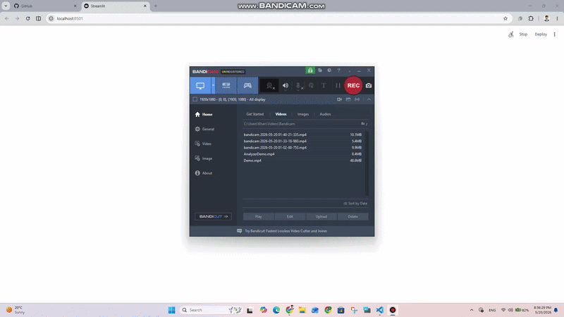

# 🌿 Eco-CSR AI Consultant | RAG-Powered Autonomous Agent


## 📖 Project Description
The **Eco-CSR AI Consultant** is an enterprise-grade, autonomous AI application built to help businesses align sustainability with profitability. Moving away from generic AI chatbots, this agent implements a highly specialized **Retrieval-Augmented Generation (RAG)** framework. It dynamically processes dense corporate sustainability data, financial reports, and decarbonization case studies to generate actionable strategies that reduce operational costs, optimize resource management, and drive sustainable revenue growth.

By utilizing advanced orchestration tools, the agent strictly grounds its intelligence in verified local vector databases. This specialized architecture completely prevents AI hallucinations and ensures that every response delivered to the client is secure, context-aware, and backed by factual corporate data.

## 🎥 Agent in Action


## ✨ Key Features
* **High-Dimensional Vector Ingestion:** Leverages Google's state-of-the-art Gemini Embeddings (3072 dimensions) mapped into a Serverless Pinecone Vector Database for ultra-precise data mapping and semantic search.
* **Stateful Multi-Turn Memory:** Engineered with LangGraph state machines and an SQLite persistence layer (`checkpoints.db`) to preserve deep conversational context across continuous, multi-turn enterprise consulting sessions.
* **Production-Ready Resilience:** Equipped with automated rate-limiting guards and exponential backoff retry workflows to ensure uninterrupted interaction even during peak API resource loads.
* **Executive Frontend Experience:** Delivered via a fully optimized, custom-styled Streamlit interface tailored for an intuitive corporate user experience.

## 🛠️ Tech Stack
* **Frameworks:** LangChain, LangGraph Core
* **LLM & Embeddings:** Google Gemini 2.5 Flash, Gemini Embedding Models (MRL Optimized)
* **Vector Store:** Pinecone Serverless Database
* **State Management:** SQLite Checkpointer Runtime
* **Interface UI:** Streamlit Web Server (Custom CSS & HTML Injection)

---

## 🚀 How to Run This Project Locally

If you are cloning this repository for the first time, follow this complete technical setup guide to deploy and execute the application on your local workstation.

### Prerequisites
Ensure your local environment has **Python 3.11 or higher** installed.

### 1. Clone the Repository
Clone this project repository using Git and navigate straight into the project root directory:
```bash
git clone https://github.com/iAmirJ/eco-csr-agent.git
cd eco-csr-agent